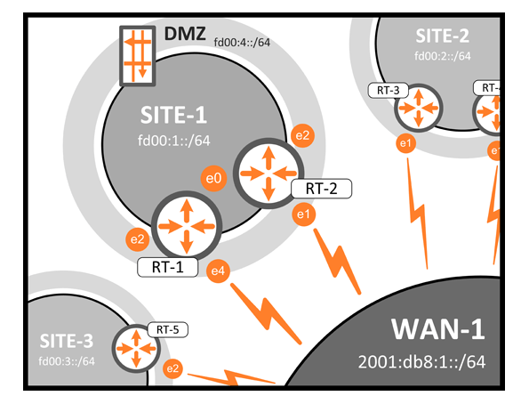

# Der VyOS-Praktiker

Enterprise-Routing f&uuml;r Consumer-Preise? Damit lockt [VyOS](https://vyos.io) seine Anwender und der Marktanteil steigt. Aber wie gut funktionionieren diese Versprechen in der Praxis?

__Das Buch ist erh&auml;ltlich seit Oktober 2017 als E-Book oder gedrucktes Buch.__

Ein Blick ins [Inhaltsverzeichnis](Inhaltsverzeichnis.md).

## Enterprise-Routing mit Open-Source

VyOS ist ein quelloffenes Betriebssystem f&uuml;r Router, Switche und Firewalls. Dieses Buch gibt mit 30 Beispielszenarien aus der Praxis einen schnellen Einstieg in die vielf&auml;ltigen M&ouml;glichkeiten von VyOS.

Jedes Kapitel erkl&auml;rt eine Problemsituation, beschreibt die theoretischen Grundlagen und stellt ein Laborexperiment zum Nachvollziehen vor. Schlie&szlig;lich zeigt es den L&ouml;sungsansatz mit Methoden von VyOS und die Parallelen zu Ubiquiti EdgeOS.

Die Kapitel sind weitgehend unabh&auml;ngig voneinander, steigern sich aber in ihrem Niveau. So sind die Themen geeignet vom Einsteiger bis zum Profi.

F&uuml;r Umsteiger von anderen gro&szlig;en Netzwerkausr&uuml;stern gibt es viele Hilfestellungen f&uuml;r die kleinen Unterschiede.

## Reinschnuppern

### Leseprobe
Kapitel 19 _Virtual Router Redundancy Protocol_ gibt es als kostenlose [Leseprobe](Leseprobe_19vrrp.pdf) zum Einstimmen auf VyOS.

### Netzdiagramm
Fast alle Kapitel benutzen denselben Netzaufbau und diegleichen IPv4/IPv6-Adressen. Das Netzdiagramm gibts als Download im Format [PDF](Netzdiagramm.pdf) oder [PNG](Netzdiagramm.png).

## Resourcen

* Was ist drin im Buch? Ein Blick ins [Inhaltsverzeichnis](Inhaltsverzeichnis.md) zeigt die behandelten Themen.

* Die vollst&auml;ndige [Konfiguration](Kapitel/) der VyOS-Router aller Kapitel zum Nachbauen oder f&uuml;rs Verst&auml;ndnis. Dort liegen auch die verwendeten Skripte und Ergebnisse der Messungen.

* Das [Korrekturverzeichnis](errata.pdf) listet die inhaltlichen Fehler und ihre Verbesserung.

* Buch kaufen bei [Amazon](https://www.amazon.de/VyOS-Praktiker-Enterprise-Routing-mit-Open-Source/dp/3744896412/) oder [BoD](https://www.bod.de/buchshop/der-vyos-praktiker-markus-stubbig-9783744896412)

* Kontakt zum Autor per [E-Mail](mailto:der.vyos.praktiker@gmail.com)

* Fehler melden. [E-Mail](mailto:der.vyos.praktiker@gmail.com?subject=Fehler)

* [Benchmarks](Kapitel/30)

* [Stichwortverzeichnis](Stichwortverzeichnis.pdf)

* [Impressum](Impressum.md)

